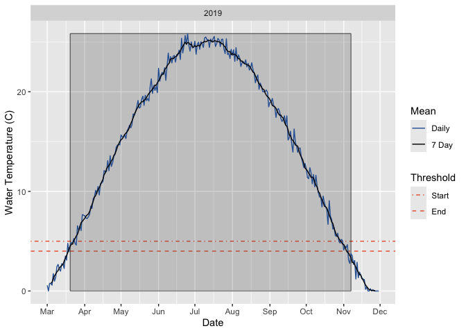

# evrfish

## Introduction

`evrfish` is an R package for EVR Fish Projects. It is intended to be
used by EVR staff and contractors and anyone else who finds it useful.

Additional information is available at
<https://poissonconsulting.github.io/evrfish/>.

## Installation

To install from [GitHub](https://github.com/poissonconsulting/evrfish)

``` r

# install.packages("remotes")
remotes::install_github("poissonconsulting/evrfish")
```

or from [r-universe](https://poissonconsulting.r-universe.dev/evrfish).

``` r

install.packages("evrfish", repos = c("https://poissonconsulting.r-universe.dev", "https://cloud.r-project.org"))
```

## Demonstration

### Growing Season Degree Days

[`gsdd()`](https://poissonconsulting.github.io/evrfish/reference/gsdd.md)
takes data frame with a `date` and `temperature` column with the mean
daily water temperature in centigrade and calculates the growing season
degree days (GSDD).

``` r

library(evrfish)
gsdd(gsdd::temperature_data)
#> # A tibble: 1 × 2
#>    year  gsdd
#>   <int> <dbl>
#> 1  2019 3899.
```

[`gdd()`](https://poissonconsulting.github.io/evrfish/reference/gdd.md)
calculate the growing degree days (GDD) to a date.

``` r

gdd(gsdd::temperature_data, end_date = as.Date("1972-08-30"))
#> # A tibble: 1 × 2
#>    year   gdd
#>   <int> <dbl>
#> 1  2019 3102.
```

[`gss()`](https://poissonconsulting.github.io/evrfish/reference/gss.md)
calculates the growing season(s) (GSS).

``` r

gss(gsdd::temperature_data)
#> # A tibble: 1 × 5
#> # Groups:   year [1]
#>    year start_dayte end_dayte   gsdd truncation
#>   <int> <date>      <date>     <dbl> <chr>     
#> 1  2019 1971-03-20  1971-11-07 3899. none
```

`gss_plots()` plots the temperature time series including growing
season(s), moving average and thresholds.

``` r

gss_plot(gsdd::temperature_data)
```



### ATUs

[`date_atus()`](https://poissonconsulting.github.io/evrfish/reference/date_atus.md)
calculates the date on which a specified number of accumulated thermal
units are exceeded.

``` r

date_atus(gsdd::temperature_data, start_date = as.Date("1972-06-15"), atus = 600)
#> # A tibble: 2 × 4
#> # Groups:   year [2]
#>    year start_date end_date    atus
#>   <int> <date>     <date>     <dbl>
#> 1  2018 1971-06-15 NA           NA 
#> 2  2019 1971-06-15 1971-07-09  613.
```

## Contribution

Please report any
[issues](https://github.com/poissonconsulting/evrfish/issues).

[Pull requests](https://github.com/poissonconsulting/evrfish/pulls) are
always welcome.

## Code of Conduct

Please note that the evrfish project is released with a [Contributor
Code of
Conduct](https://contributor-covenant.org/version/2/1/CODE_OF_CONDUCT.html).
By contributing to this project, you agree to abide by its terms.
